<authentication_analysis>
1) Przepływy autentykacji:
- Rejestracja rodzica z automatycznym zalogowaniem i przekierowaniem do onboardingu dziecka.
- Logowanie użytkownika (rodzic/admin) i przekierowanie do właściwego panelu.
- Wylogowanie użytkownika z aplikacji i powrót do strony logowania.
- Odzyskiwanie hasła: wysłanie maila resetującego i ustawienie nowego hasła.
- Ochrona tras przez middleware: brak dostępu bez sesji, wymuszenie onboardingu dziecka.
- Obsługa wygaśnięcia sesji/tokenu i odświeżanie sesji przez Supabase (automatycznie po stronie SDK/sesji).

2) Aktorzy i interakcje:
- Przeglądarka (użytkownik, UI React/strony Astro) inicjuje akcje formularzy.
- Middleware Astro (server-side) weryfikuje sesję i role, decyduje o przekierowaniach.
- Astro API (server endpoints) wykonuje operacje auth: signUp, signIn, signOut, reset, update.
- Supabase Auth (usługa) zarządza sesją, tokenami, resetem hasła, aktualizacją hasła.

3) Weryfikacja i odświeżanie tokenów:
- Sesja Supabase oparta o cookie i tokeny (access/refresh) – weryfikacja wykonywana w `locals.supabase.auth.getUser()` w middleware i w API.
- Odświeżanie tokenu: po wygaśnięciu access tokenu Supabase wykorzystuje refresh token do uzyskania nowego; gdy refresh wygasł/nieważny, middleware/API otrzymuje brak użytkownika i następuje redirect do logowania.

4) Kroki autentykacji (skrót):
- Rejestracja: Browser → API/register → Supabase signUp → sesja → redirect do onboardingu.
- Logowanie: Browser → API/login → Supabase signIn → sesja → middleware rozróżnia role → redirect.
- Wylogowanie: Browser → API/logout → Supabase signOut → middleware wykrywa brak sesji → redirect do login.
- Reset hasła: Browser → API/reset → Supabase email z linkiem → Browser (po linku) → API/update-password → Supabase updateUser → redirect do loginu.
- Ochrona tras: Browser → Middleware getUser → alt: zalogowany i ma dzieci (rodzic) → dostęp; else: brak sesji → login; else: brak dzieci → onboarding.
- Wygaśnięcie tokenu: Browser/API/Middleware → Supabase zwraca brak użytkownika/expired → redirect do loginu; jeśli refresh dostępny → automatyczne odświeżenie i kontynuacja.

```mermaid
sequenceDiagram
  autonumber
  participant Browser as Przeglądarka (UI)
  participant Middleware as Middleware Astro
  participant API as Astro API (Auth)
  participant Auth as Supabase Auth

  Note over Browser: Start: użytkownik odwiedza stronę auth
  activate Browser
  Browser->>API: Żądanie GET strony login/register
  deactivate Browser

  Note over Middleware,Browser: Ochrona tras (guard)
  activate Middleware
  Middleware->>Auth: getUser() (weryfikacja sesji)
  alt Sesja istnieje
    Middleware-->>Browser: Redirect do panelu (rola)
  else Brak sesji
    Middleware-->>Browser: Pozostań na stronie auth
  end
  deactivate Middleware

  Note over Browser,API: Rejestracja użytkownika (rodzic)
  activate Browser
  Browser->>API: POST /register (email, hasło)
  activate API
  API->>Auth: signUp(email, password)
  alt Rejestracja sukces
    Auth-->>API: Sesja utworzona
    API-->>Browser: 200 { redirectTo: onboarding }
    Browser->>Middleware: Przejście do /app/onboarding/child
    activate Middleware
    Middleware->>Auth: getUser() (sprawdź sesję)
    Middleware-->>Browser: Dostęp do onboardingu
    deactivate Middleware
  else Rejestracja nieudana
    Auth-->>API: Błąd (email istnieje)
    API-->>Browser: 400 "Konto już istnieje"
  end
  deactivate API
  deactivate Browser

  Note over Browser,API: Logowanie (rodzic/admin)
  activate Browser
  Browser->>API: POST /login (email, hasło)
  activate API
  API->>Auth: signInWithPassword
  alt Logowanie sukces
    Auth-->>API: Sesja utworzona
    API-->>Browser: 200 { role, redirectTo }
    Browser->>Middleware: Nawigacja do panelu
    activate Middleware
    Middleware->>Auth: getUser() (rola)
    alt Rola admin
      Middleware-->>Browser: Redirect /admin/activities
    else Rola rodzic
      Middleware->>API: Sprawdź dzieci (onboarding)
      alt Ma co najmniej jedno dziecko
        Middleware-->>Browser: Redirect /app/dashboard
      else Brak dzieci
        Middleware-->>Browser: Redirect /app/onboarding/child
      end
    end
    deactivate Middleware
  else Logowanie nieudane
    Auth-->>API: Błąd (invalid credentials)
    API-->>Browser: 401 "Nieprawidłowy e-mail lub hasło"
  end
  deactivate API
  deactivate Browser

  Note over Browser,API: Odzyskiwanie hasła
  activate Browser
  Browser->>API: POST /reset (email)
  activate API
  API->>Auth: resetPasswordForEmail(email, redirect)
  Auth-->>Browser: Email z linkiem resetu (poza systemem)
  deactivate API
  deactivate Browser

  Note over Browser,API: Ustawienie nowego hasła
  activate Browser
  Browser->>API: POST /update-password (newPassword)
  activate API
  API->>Auth: updateUser({ password })
  alt Aktualizacja sukces
    Auth-->>API: OK
    API-->>Browser: 200 Redirect do /auth/login
  else Aktualizacja nieudana
    Auth-->>API: Błąd (token wygasł)
    API-->>Browser: 400 "Link wygasł"
  end
  deactivate API
  deactivate Browser

  Note over Browser,Middleware: Dostęp do chronionej trasy po zalogowaniu
  activate Browser
  Browser->>Middleware: Żądanie /app/dashboard
  activate Middleware
  Middleware->>Auth: getUser() (sprawdzenie sesji)
  alt Sesja ważna
    Middleware-->>Browser: Dostęp przyznany (SSR)
  else Sesja wygasła
    Middleware-->Browser: Redirect do /auth/login
  end
  deactivate Middleware
  deactivate Browser

  Note over API,Auth: Odświeżanie tokenu (automatyczne)
  API->>Auth: Próba z zasobem, access token wygasł
  alt Refresh dostępny
    Auth-->>API: Nowy access token (odświeżony)
    API-->>Browser: Kontynuacja odpowiedzi
  else Refresh nieważny
    Auth-->>API: Brak sesji
    API-->Browser: 401 i instrukcja logowania
  end

  Note over Browser,API: Wylogowanie
  activate Browser
  Browser->>API: POST /logout
  activate API
  API->>Auth: signOut()
  Auth-->>API: OK
  API-->>Browser: 200 Redirect /auth/login
  deactivate API
  deactivate Browser
```

</authentication_analysis>

<mermaid_diagram>

</mermaid_diagram>
